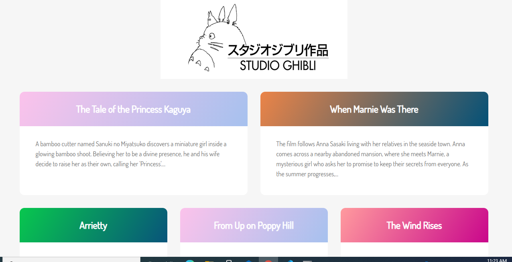

# studioGhibliAPI

------------------
## Table of contents

1. [About](#about)
2. [Inspiration](#inspiration)
3. [Usage](#usage)
4. [Screenshots](#screenshots)
5. [Technologies](#technologies)
6. [Setup](#setup)
7. [Links](#links)
8. [To-do List](#todo)
9. [Status](#status)
10. [Credits](#credits)

------------------
## About 

This is a simple app that makes a GET call to the Ghibli Studios API and returns movie titles and descriptions to the web page. 

------------------
## Inspiration 

Wanting to practice more coding that involves calls to APIs, I built this site following a tutorial that was put together by Tania Rascia, found at https://www.taniarascia.com/how-to-connect-to-an-api-with-javascript/.    

------------------
## Screenshots 
First Page: 

------------------
## Technologies 

* HTML
* CSS
* JavaScript

------------------
## Links 

* github: [https://github.com/jbenj-upenn/studioGhibliAPI]
* page:  [https://jbenj-upenn.github.io/studioGhibliAPI/]

------------------
## To-do list (future additions): 

* Allow users to retrieve full movie descriptions when clicking on them. 

------------------
## Status 

Project is: in progress.

------------------
## Credits 

Thanks to Ms. Rascia for creating this tutorial and walking students/coders through it. 

## Copyright and Collaborators

© 2021 Josh Benjamin
